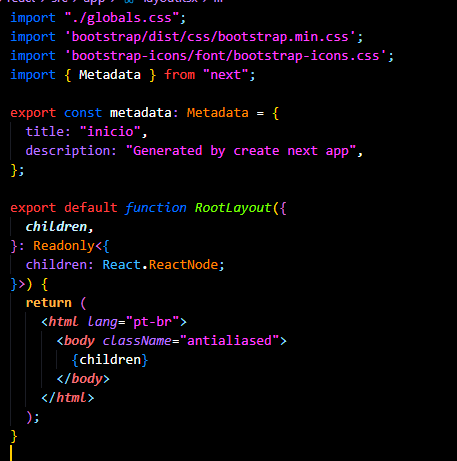
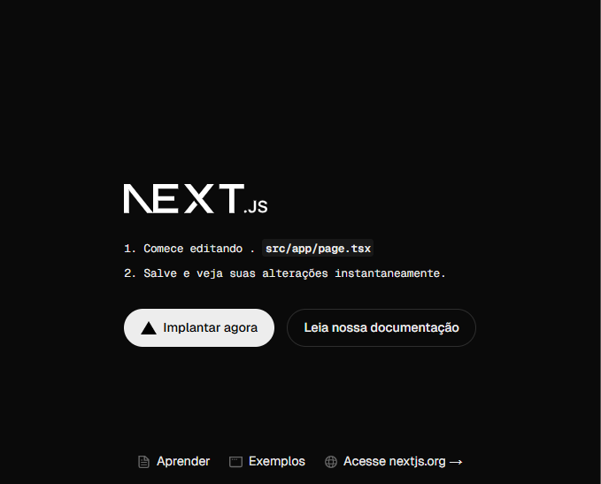

# 🚀 Projeto Criado com React + Next.js

Projeto desenvolvido como parte do aprendizado em React e Next.js, **sem uso do ChatGPT**, seguindo aulas disponíveis no YouTube. A ideia é aplicar os conhecimentos adquiridos e construir uma base sólida com React e o framework Next.js.

---

## 🛠️ Tecnologias Usadas no Projeto

- [Next.js](https://nextjs.org/) – Framework React para aplicações web modernas
- [React](https://reactjs.org/) – Biblioteca JavaScript para construção de interfaces
- [Bootstrap 5](https://getbootstrap.com/) – Framework de CSS para layout responsivo
- [Bootstrap Icons](https://icons.getbootstrap.com/) – Ícones oficiais do Bootstrap

## 🛠️ Como Baixar as Bibliotecas do Bootstrap e Bootstrap Icons

Para instalar o **Bootstrap** e **Bootstrap Icons** via npm, execute os seguintes comandos:

### 1. **Instalar o Bootstrap:**

```bash
npm install bootstrap
```

### 2. **Instalar o Bootstrap-icons:**
```bash
npm install bootstrap-icons
```

Logo em seguida exporta no layout.tsx



## 🛠️ Como criar um projeto em React (Next.js)

Para criar este projeto, segui a documentação oficial do Next.js:

📄 [Documentação: Create Next App](https://nextjs.org/docs/app/api-reference/cli/create-next-app)

### Comando usado:

```bash
npx create-next-app@latest
```
O projeto foi criado no mesmo diretório em que já existia o projeto app-react.

## ▶️ para começar:


Para começar, basta rodar o servidor de desenvolvimento com um dos seguintes comandos:

```bash
npm run dev
# ou
yarn dev
# ou
pnpm dev
# ou
bun dev
```

Logo apos abrir o link [http://localhost:3000](http://localhost:3000) em seu navegador para ver o resultado.

e nele vai abrir a seguinte tela:



ele vai pedir para começar a editar o page.tsx

